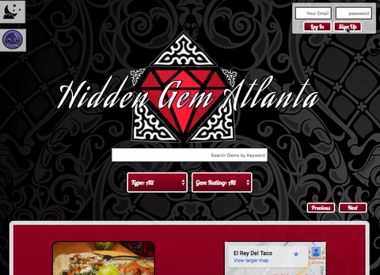
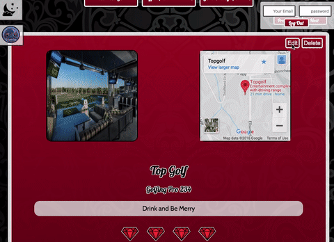
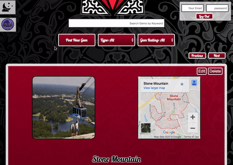
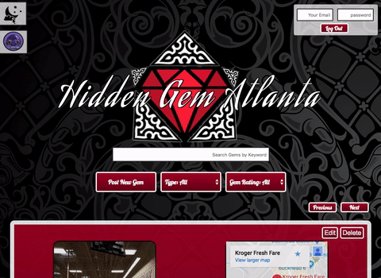

# Atlanta GEMS (developed under codename: Order 66)

## Live Demo
[Atlanta GEMS](https://www.iangornall.com/ExecutiveOrder66)

## Contents
  * Description
  * Technologies
  * Challenges and Solutions
  * MVP
  * Our Stretch Goals
  * Authors

## Description

This project is a front end interface to accept a post (a gem) from a user. The gems are stored in firebase, and retrieved and displayed by to the visitor.

This is a GROUP collaboration with:

  * Nathan Reese
  * Matthew Marberry
  * Ian Gornall

  (aka the Legion of Doom)

This project requires Firebase Realtime Database, Firebase Auth, and google maps/search API keys. If you wish to run it, put your keys in keys.js and go to town!  (see what I did there? Cause it's about Atlanta)

### Features

#### User Authentication with Firebase

Users can sign up, log in, and log out.  Logged in users can post, edit posts, and delete posts (see below).

#### Post New Gems

Users can make new posts by entering a location name, rating, and description.  Images of the location are fetched by Google's custom search API.  Maps are fetched from Google Maps API.

#### Edit Gems

Users can edit gems they originally posted.

#### Filter Gems

Users can filter gems by keywords found in title or description, by category and by rating.

#### Pagination

Users can view five gems at a time on each page.

#### Night and Day Modes

Users can view page in night and day mode according to preference.

### What problem motivated this app
A visitor to Atlanta will not know what unique sights/venues/etc the locals are passionate about. Plus they don't want to just wander idly around the city and get stabbed or accosted by our horde of zombies.

### Who are our users
Visitors to the area, curious to see the highlights of the city.
Residents of the city that want to share what makes Atlanta a GEM.

### Elevator pitch
You are in Atlanta only briefly, a visit or perhaps business.  Probably because you flew in here on your way someplace better. You want to know what to see here, and you want it from people who love the city, not some commercial crap.

## Technologies
  * HTML, CSS, JavaScript
  * Google Firebase Database and FireAuth
  * Google Custom Search API
  * Google Maps API

## Challenges and Solutions
This was our first group project.  Adapting to using git for collaboration was the major challenge for us.

  * Challenge #1: JavaScript and CSS selectors:

  As we added content to the page, we often reused the same classes to style new elements.  These elements were often (wrongly) selected because we had query selected by the class, causing buggy behavior.  The solution was to add new classes and select by these.

  * Challenge #2: Google Image Search:

  By default the google custom search has the safety filter off, which is a problem if you embed images found.  This was a simple fix by adding a parameter to the request to google api.

  * Challenge #3: Displaying feedback to users and properly handling errors.

  Because users were having to submit data properly, errors in form submission needed to be handled properly using flash messages.  Similarly, there could be errors when entering data into firebase, when authenticating, and even when grabbing images from the image search.  Due to the nature of callbacks, this required many instances of code.

  * Challenge #4: Squashing bugs.

  Several times during the project we introduced bugs into our code without realizing it for a couple of commits.  Doing the due diligence of looking back through the commits to find how the bug arose, and then fixing the problem was challenging, but we got better at it over time.

  * Challenge #5: Firebase
  
  Firebase was new to every team member.  Reading through the documentation and implementing both the database and authentication were challenging.  Also, setting security rules so that only valid data could enter the server took many tries.

## MVP (Minimum Viable Product)
Considering this was intended to be a front-end only project, we were ambitious in making a serverless web app with a database running in the cloud.

Our initial MVP included:
* Ability to post gems to database
* Gems generate images and maps
* Able to view gems retrieved from database

## Our Stretch Goals
Once we had our MVP, we realized a number of additional goals:
* Authenticating users
* Users able to edit and delete their own posts
* Paginated content
* Filtered content by search, rating, and type
* Flash messages
* Secure database

If we had more time we would have...
* Consistent Style
* Profit
* Optimize the code
* Image/map loading with google is slow... spinner?
* Check out the site load in Lighthouse and in the Network panel.  Apply fixes.

## Authors
  * [Ian Gornall](https://github.com/iangornall/)
  * [Matthew Marberry](https://github.com/marberrym)
  * [Nathan Reese](https://github.com/somelinuxguy)
