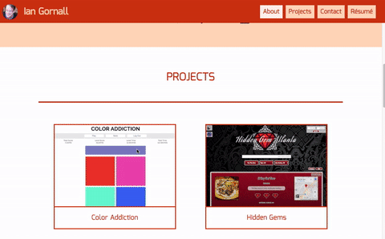
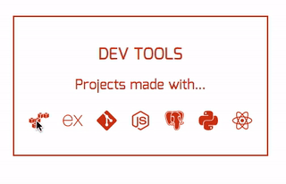
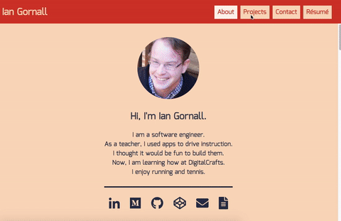
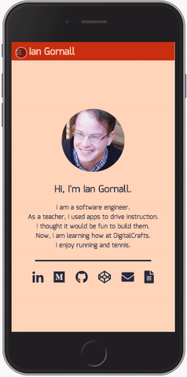

# Web Portfolio
This is a personal portfolio page built with plain HTML, CSS, and JavaScript.

## Features
### Modals

#### Description
Provides user with extra information about each project.
##### Code
[JS file on github](./js/modal.js)

### Tooltips

#### Description
Provides user with information about development icons.
##### Code
```Javascript
let createTooltip = (query, text) => {
    let targetElement = document.querySelector(query);
    targetElement.addEventListener('mouseover', event => {
        tooltip.textContent = text;
        event.currentTarget.appendChild(tooltip);
    });
    targetElement.addEventListener('mouseout', event => {
        tooltip.remove();
    });
}
```

### Auto Scroll

#### Description
Provides user with smooth scrolling transition on clicking a link within the page.
##### Code
```Javascript
function scrollTransition(destination){
    var duration = 500;
    var destElement = document.getElementById(destination);
    var end = destElement.offsetTop - headerHeight + 1;
    var start = (scrollingContent.scrollTop);
    var scrollDistance = end - start;
    var scrollStep = Math.PI / (duration / 10);
    var count = 0, currPos;
    scrollInterval = setInterval(function(){
        if (currPos != end) {
            count++;
            currPos = start + scrollDistance * (0.5 - 0.5 * Math.cos(count * scrollStep));
            scrollingContent.scrollTop = currPos;
        }
        else { 
            clearInterval(scrollInterval); 
        }
    },10);
}
```
### Responsive menu

#### Description
Provides user with accessible menu for mobile.
##### Technology
CSS breakpoints

